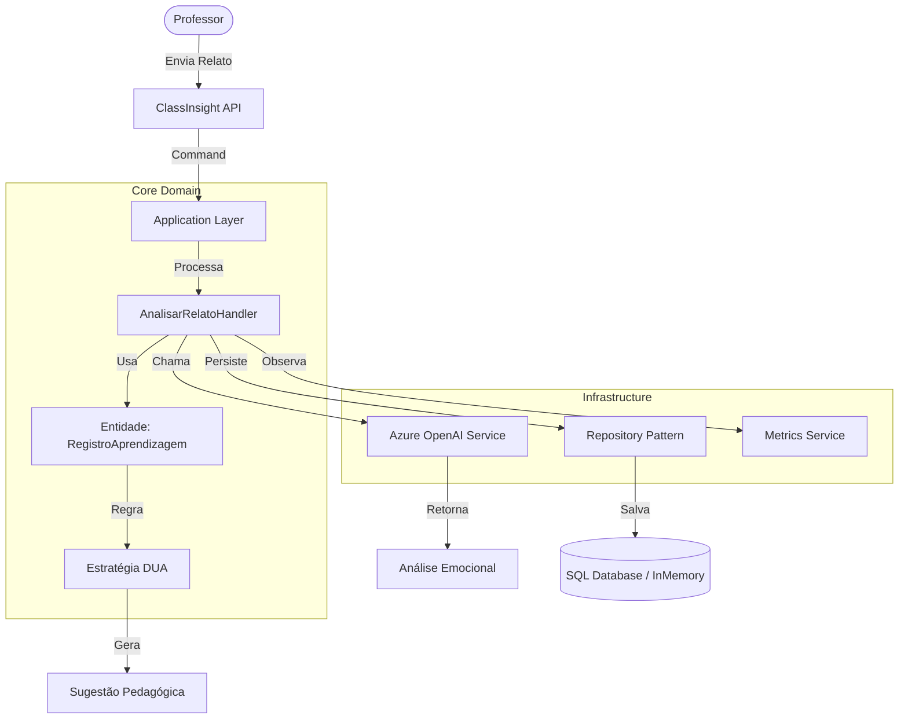

# 🎓 ClassInsight: Community Edition

> **Inteligência Artificial Generativa aplicada à Inclusão Escolar e ao Desenho Universal para Aprendizagem (DUA).**


---

## 📄 Sobre o Projeto

O **ClassInsight** nasceu da interseção entre 15 anos de experiência em gestão educacional e a moderna Engenharia de Software. Este projeto resolve um problema crítico na educação: a dificuldade de personalizar o ensino em larga escala sem sobrecarregar os professores.

Utilizando **IA Generativa (LLMs)** e os princípios do **Desenho Universal para Aprendizagem (DUA)**, o sistema analisa relatos docentes anonimizados, detecta padrões emocionais (como frustração recorrente) e gera trilhas pedagógicas adaptativas automaticamente.

### 🎯 Diferenciais Pedagógicos
* **Diagnóstico Emocional:** Identifica se o aluno está engajado, frustrado ou apático baseando-se na análise de sentimento.
* **Estratégias DUA:** As sugestões não são genéricas; elas são categorizadas em *Engajamento*, *Representação* e *Ação/Expressão*.
* **RAG (Retrieval-Augmented Generation):** O sistema "lembra" do histórico recente do aluno para contextualizar novas intervenções, evitando a repetição de métodos que já falharam.

---

## 🏗️ Arquitetura Técnica

O projeto foi construído seguindo rigorosamente os princípios da **Clean Architecture** e **Domain-Driven Design (DDD)**, garantindo que as regras de negócio pedagógicas não dependam de detalhes de infraestrutura.

### Fluxo de Dados (C4 Model - Level 2)



### 🛠️ Tecnologias Utilizadas

* **Core:** .NET 9 (C#)
* **Arquitetura:** Clean Architecture, DDD, Mediator Pattern.
* **Testes:** xUnit, Moq, FluentAssertions (100% de Cobertura nos Core Use Cases).
* **IA & Cloud:** Integração preparada para Azure OpenAI (com fallback para Fakes em ambiente local).
* **CI/CD:** GitHub Actions configurado para Build e Testes automatizados.

---

## 🚀 Como Executar Localmente

### Pré-requisitos

* [.NET SDK 9.0](https://dotnet.microsoft.com/download)
* Git

### Passo a Passo

1. **Clone o repositório:**
```bash
git clone [https://github.com/cleofasjunior/ClassInsight-Community.git](https://github.com/cleofasjunior/ClassInsight-Community.git)
cd ClassInsight-Community

```


2. **Restaure as dependências:**
```bash
dotnet restore

```


3. **Execute a API:**
```bash
dotnet run --project src/ClassInsight.API

```


4. **Acesse a Documentação (Swagger):**
Abra seu navegador em `http://localhost:5000/swagger` (ou a porta indicada no terminal) para testar os endpoints de `AnalisarRelato` e `GerarTrilha`.

---

## 🧪 Qualidade e Testes

A robustez do código é garantida por uma suíte de testes unitários e de integração. Para verificar a integridade do sistema, execute:

```bash
dotnet test

```

> **Nota:** O pipeline de CI/CD executa automaticamente esses testes a cada *push* na branch principal, garantindo que nenhuma regra de negócio pedagógica seja quebrada por alterações técnicas.

---

## 📚 Conceitos Fundamentais

### O que é "Frustração Recorrente"?

No código, implementamos uma lógica de **RAG Simplificado**. Se um aluno apresenta sentimento `Negativo` em mais de 2 registros nos últimos 5 relatos, o sistema altera o *prompt* enviado à IA para focar especificamente na recuperação da autoestima e engajamento, em vez de focar apenas no conteúdo técnico.

### Value Objects e Imutabilidade

Utilizamos `records` (como `AnaliseEmocional` e `SugestaoDua`) para garantir que os dados diagnósticos sejam imutáveis, aumentando a segurança e a previsibilidade da aplicação em ambientes concorrentes.

---

## 👨‍💻 Autor

**Cleófas Júnior**

* **Doutor em Educação** (UFPB) com foco em Políticas Educacionais e Inclusão.
* **Gestor de Projetos** com +15 anos de experiência liderando equipes multidisciplinares.
* **Engenheiro de Software em Transição**, unindo a expertise acadêmica com o desenvolvimento de soluções tecnológicas robustas em .NET.

---

*Este projeto é Open Source sob a licença MIT.*
