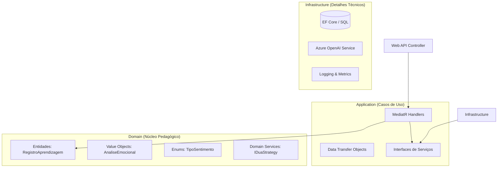

# 🏛️ Guia de Arquitetura: ClassInsight

Este documento descreve a arquitetura de software, os padrões de design e as decisões técnicas fundamentais do projeto **ClassInsight**. O sistema foi projetado para ser modular, testável e escalável, unindo conceitos avançados de Engenharia de Software com princípios de Inclusão Pedagógica.

---

## 1. Visão Geral e Estilo Arquitetural

O ClassInsight adota a **Clean Architecture** (Arquitetura Limpa), com forte influência de **Domain-Driven Design (DDD)**. O objetivo central é manter as regras de negócio (núcleo pedagógico) isoladas de detalhes técnicos como banco de dados, interfaces de usuário ou serviços de IA externos.

### Diagrama de Dependência (Onion Architecture)

O fluxo de dependência aponta sempre para dentro. O Domínio não conhece ninguém; a Aplicação conhece o Domínio; a Infraestrutura conhece ambos.

---

## 2. Estrutura de Camadas (Drill-Down)

### 🔵 2.1. ClassInsight.Domain (O Coração)

Esta camada é pura. Não possui dependências de bibliotecas externas (exceto o próprio .NET). Aqui residem as regras imutáveis do negócio educacional.

* **Entidades:** Objetos com identidade e ciclo de vida (ex: `RegistroAprendizagem`). Implementam lógica rica, não são apenas sacos de dados.
* **Value Objects:** Objetos imutáveis definidos por seus atributos (ex: `AnaliseEmocional`, `SugestaoDua`). Essenciais para garantir a integridade dos dados diagnósticos.
* **Interfaces de Repositório:** Contratos que definem como os dados devem ser salvos, sem saber *onde* (ex: `IRegistroRepository`).
* **Enums:** Linguagem Ubíqua do sistema (ex: `TipoSentimento`, `PrincipioDua`).

### 🟢 2.2. ClassInsight.Application (A Orquestração)

Responsável por coordenar os fluxos de trabalho. Utiliza o padrão **CQRS** (Command Query Responsibility Segregation) simplificado via **MediatR**.

* **Use Cases (Handlers):** Cada ação do sistema é uma classe isolada (ex: `AnalisarRelatoHandler`, `GerarTrilhaHandler`). Isso respeita o Princípio da Responsabilidade Única (SRP).
* **DTOs:** Objetos simples para transportar dados entre a API e o Domínio, protegendo a estrutura interna das entidades.
* **Interfaces de Aplicação:** Contratos para serviços de infraestrutura (ex: `IMetricsService`, `IAiService`).

### 🟠 2.3. ClassInsight.Infrastructure (O Mundo Real)

Implementa as interfaces definidas nas camadas superiores. É aqui que o sistema "suja as mãos" com I/O.

* **Persistência:** Entity Framework Core (podendo alternar entre InMemory, SQL Server ou PostgreSQL).
* **Serviços de IA:** Implementação do cliente Azure OpenAI.
* **Observabilidade:** Implementação de logs e métricas.
* **Injeção de Dependência:** Configuração centralizada (`ServiceCollectionExtensions`).

### 🔴 2.4. ClassInsight.API (A Porta de Entrada)

Uma camada fina (Thin Controllers) que apenas recebe requisições HTTP, converte para Commands do MediatR e retorna a resposta. Não contém regras de negócio.

---

## 3. Padrões de Design Chave

### 🧩 Mediator Pattern (via MediatR)

Utilizado para desacoplar a API da lógica de aplicação. O Controller apenas envia uma mensagem ("Comando") e desconhece quem vai processá-la.

* *Benefício:* Facilita testes unitários e permite adicionar comportamentos transversais (logs, validação) via Pipeline Behaviors.

### 🧠 RAG Simplificado (Retrieval-Augmented Generation)

No caso de uso `GerarTrilha`, implementamos uma lógica de RAG. O sistema busca o histórico recente do aluno (Retrieve) e injeta esse contexto no prompt da IA (Generate).

* *Aplicação Pedagógica:* Se o aluno tem histórico de frustração, a IA adapta a trilha para focar em engajamento emocional antes do conteúdo técnico.

### 🛡️ Value Objects (Imutabilidade)

Usamos `records` do C# para objetos como `AnaliseEmocional`.

* *Benefício:* Garante que uma análise feita pela IA não seja alterada acidentalmente durante o processamento, garantindo a integridade do diagnóstico pedagógico.

### 🏭 Strategy Pattern (Lógica DUA)

A interface `IDuaStrategy` permite que a lógica de sugestão pedagógica mude sem alterar a entidade principal. Hoje usamos uma estratégia baseada em regras, mas futuramente podemos ter estratégias baseadas em Machine Learning.

---

## 4. Decisões Técnicas (ADR - Architecture Decision Records)

| Decisão | Opção Escolhida | Justificativa |
| --- | --- | --- |
| **Framework** | .NET 9 | Performance superior, suporte nativo a conteinerização e recursos modernos de C#. |
| **Comunicação** | MediatR (In-Process) | Simplicidade inicial com total desacoplamento, facilitando migração futura para Microservices se necessário. |
| **IA Client** | Semantic Kernel / Azure SDK | Abstração robusta para lidar com LLMs, permitindo troca fácil de modelos (GPT-4, Llama, etc). |
| **Testes** | xUnit + Moq + FluentAssertions | Padrão de mercado, sintaxe expressiva e ótima integração com CI/CD. |
| **Tratamento de Erros** | Result Pattern / Exceptions | Uso de DTOs ricos para evitar "estouro" de exceções não controladas na API. |

---

## 5. Estratégia de Testes

A integridade arquitetural é garantida por uma pirâmide de testes:

1. **Testes de Unidade (UnitTests):** Focados nos Handlers e Entidades. Utilizam Mocks para isolar dependências (IA, Banco). Validam a lógica pedagógica e o mapeamento de DTOs.
2. **Testes de Integração (IntegrationTests):** Levantam a aplicação em memória (`WebApplicationFactory`). Testam o fluxo HTTP completo (Controller -> Handler -> Infra Fake), garantindo que a injeção de dependência e os contratos de API estejam corretos.

---

## 6. Evolução Futura

Esta arquitetura foi desenhada para suportar crescimento:

* **Event Sourcing:** O `RegistroAprendizagem` pode evoluir para armazenar eventos (`RelatoAnalisado`, `TrilhaGerada`), permitindo auditoria pedagógica completa.
* **Microserviços:** Graças ao MediatR, os Handlers podem ser movidos para serviços isolados (Workers) com uso de filas (RabbitMQ) com mínimo esforço de refatoração.

---

*Documento mantido por Cleófas Júnior - Doutor em Educação & Engenheiro de Software.*
