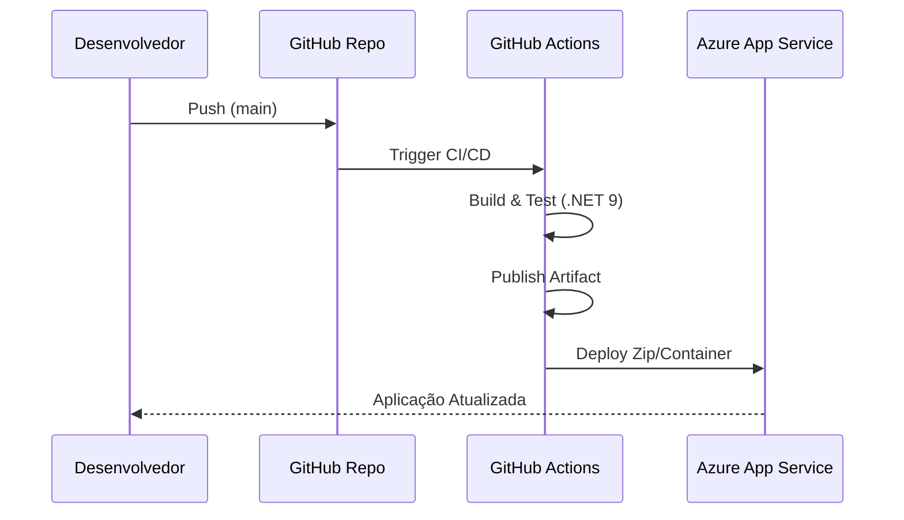

# 🚀 Guia de Deploy e Testes: ClassInsight

Este documento detalha os procedimentos operacionais para configurar, testar e implantar o **ClassInsight Community Edition**. O guia abrange desde a execução local para desenvolvimento até estratégias de containerização e deploy em nuvem (Azure).

---

## 📋 1. Pré-requisitos do Ambiente

Para executar ou implantar este projeto, o ambiente de hospedagem deve atender aos seguintes requisitos:

* **Runtime:** .NET 9.0 SDK (ou superior).
* **Container Engine:** Docker Desktop (opcional, para execução em container).
* **Cloud CLI:** Azure CLI (para deploy em nuvem).
* **Controle de Versão:** Git.

---

## ⚙️ 2. Gestão de Configuração e Segredos

O ClassInsight segue o padrão **12-Factor App**, onde as configurações são injetadas via Variáveis de Ambiente.

### Variáveis Críticas

| Variável | Descrição | Valor Padrão (Dev) | Produção (Exemplo) |
| :--- | :--- | :--- | :--- |
| `ASPNETCORE_ENVIRONMENT` | Define o modo de execução. | `Development` | `Production` |
| `AzureAi__Endpoint` | Endpoint do serviço Azure OpenAI. | *Fake Interno* | `https://meu-ai.openai.azure.com/` |
| `AzureAi__ApiKey` | Chave de acesso do serviço de IA. | *Fake Interno* | `abc12345...` |
| `ConnectionStrings__DefaultConnection` | String de conexão do Banco de Dados. | `InMemory` | `Server=tcp:bd.database.windows.net...` |

> **⚠️ Segurança:** Nunca commite o arquivo `appsettings.Production.json` com chaves reais. Em ambiente local, utilize **User Secrets**:
> ```bash
> dotnet user-secrets set "AzureAi:ApiKey" "sua-chave-real" --project src/ClassInsight.API
> ```

---

## 💻 3. Execução Local (Desenvolvimento)

Para rodar a aplicação na sua máquina para testes rápidos ou depuração:

1.  **Restaurar Dependências:**
    ```bash
    dotnet restore
    ```

2.  **Compilar o Projeto:**
    ```bash
    dotnet build --no-restore
    ```

3.  **Executar a API:**
    ```bash
    dotnet run --project src/ClassInsight.API
    ```

4.  **Validar:**
    Acesse o Swagger UI em: `http://localhost:5000/swagger`

---

## 🐳 4. Containerização (Docker)

O projeto está preparado para ser empacotado como uma imagem Docker, facilitando o deploy em qualquer orquestrador (Kubernetes, Azure Container Apps, AWS ECS).

### 4.1. Criar a Imagem
Crie um arquivo `Dockerfile` na raiz com o seguinte conteúdo padrão para .NET 9:

```dockerfile
# Estágio de Build
FROM [mcr.microsoft.com/dotnet/sdk:9.0](https://mcr.microsoft.com/dotnet/sdk:9.0) AS build
WORKDIR /src
COPY . .
RUN dotnet restore
RUN dotnet publish "src/ClassInsight.API/ClassInsight.API.csproj" -c Release -o /app/publish

# Estágio de Runtime (Imagem Final Leve)
FROM [mcr.microsoft.com/dotnet/aspnet:9.0](https://mcr.microsoft.com/dotnet/aspnet:9.0)
WORKDIR /app
COPY --from=build /app/publish .
EXPOSE 8080
ENTRYPOINT ["dotnet", "ClassInsight.API.dll"]

```

### 4.2. Construir e Rodar

```bash
# Construir a imagem
docker build -t classinsight:latest .

# Rodar o container (Porta 8080 interna mapeada para 5000 externa)
docker run -d -p 5000:8080 --name classinsight_app classinsight:latest

```

---

## ☁️ 5. Deploy na Azure (Produção)

Este guia utiliza a **Azure CLI** para criar um **App Service** (PaaS) robusto e escalável.

### Fluxo de Deploy Automatizado



### Passo a Passo Manual (Via CLI)

1. **Login na Azure:**
```bash
az login

```


2. **Criar Grupo de Recursos:**
```bash
az group create --name ClassInsightRG --location eastus

```


3. **Criar Plano de Serviço (Linux):**
```bash
az appservice plan create --name ClassInsightPlan --resource-group ClassInsightRG --sku B1 --is-linux

```


4. **Criar o Web App:**
```bash
az webapp create --resource-group ClassInsightRG --plan ClassInsightPlan --name classinsight-api --runtime "DOTNETCORE:9.0"

```


5. **Configurar Variáveis de Produção:**
```bash
az webapp config appsettings set --resource-group ClassInsightRG --name classinsight-api --settings AzureAi__ApiKey="SUA_CHAVE_REAL_AQUI"

```


6. **Deploy do Código:**
```bash
dotnet publish src/ClassInsight.API/ClassInsight.API.csproj -c Release -o ./publish
cd publish
zip -r site.zip .
az webapp deployment source config-zip --resource-group ClassInsightRG --name classinsight-api --src site.zip

```


---

## 🧪 6. Estratégia de Testes e Validação

A qualidade do deploy é garantida por três níveis de verificação automatizada.

### 6.1. Testes de Unidade (Unit Tests)

Validam a lógica isolada (Regras DUA, Análise de Sentimento).

* **Comando:** `dotnet test tests/ClassInsight.UnitTests`
* **Cobertura:** Handlers, Entidades e Value Objects.

### 6.2. Testes de Integração (Integration Tests)

Validam o fluxo completo HTTP -> Controller -> Handler -> Infra. Utilizam `WebApplicationFactory` para levantar a API em memória.

* **Comando:** `dotnet test tests/ClassInsight.IntegrationTests`

### 6.3. Verificação de Saúde (Health Check)

Após o deploy, o sistema expõe endpoints para monitoramento de uptime.

* **Endpoint:** `/health` (se configurado) ou teste simples no Swagger.

---

## 🛠️ 7. Monitoramento e Observabilidade

O sistema possui uma interface `IMetricsService` desacoplada.

* **Local:** Os logs são exibidos no Console (`ConsoleMetricsService`).
* **Produção:** Recomenda-se ativar o **Azure Application Insights** no portal da Azure para visualizar:
* Taxa de Erros (500/400).
* Tempo de resposta da IA.
* Detecção de anomalias em tempo real.


---

*Documentação mantida por Cleófas Júnior - Doutor em Educação & Engenheiro de Software.*
